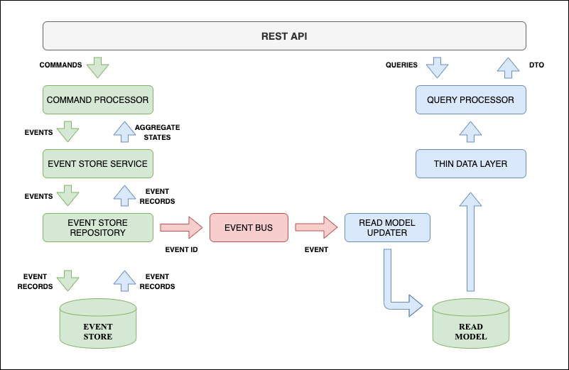

# Bank kata factory14

## 1 Description
This app is used for:
- Register a user in the bank
- Register money account for a user ( using preferred currency )
- Deposit / Withdraw operations
- Transfer money from one user account to another.

### 1.1 Used technologies

- Java 11
- H2 in-memory DB [`H2 DB`](https://www.h2database.com/html/main.html)
- Javalin [`Simple web framework`](https://javalin.io)
- Liquibase [`DB managger`](https://www.liquibase.org/)
- Jooq [`Light DB-mapping software`](https://www.jooq.org/)

### 1.2 Used design principles

- CQRS
- Event sourcing

### 1.3 Architecture design schema



## 2 How to run WITHOUT installation

```
git clone git@github.com:NikCooler/bank-kata-f14.git

cd bank-kata-f14

java -jar bank-1.0-jar-with-dependencies.jar
```

## 3 Clone, Build and Run the application

```
git clone git@github.com:NikCooler/bank-kata-f14.git

cd bank-kata-f14

mvn clean install

java -jar bank/target/bank-1.0-jar-with-dependencies.jar
```

## 4 Endpoints

The app uses server port `8083` but it's possible to change it in the `app.configuration`.
Base path is `http://localhost:8083` by default.
All endpoints use `UUID` IDs.

- Register user
```
POST   /user/:userId/register
{
    "email" : "test@email.com"
}
```
- Get user details
```
GET    /user/:userId/profile
```
- Add money account ( currently supported only one currency `EUR` )
```
PUT    /user/:userId/account/create
{
	"currency": "EUR",
	"value": 10.10
}
```
- Deposit account
```
PUT    /user/:userId/account/deposit
{
	"currency": "EUR",
	"value": 20.10
}
```
- Withdraw account
```
PUT    /user/:userId/account/withdraw
{
	"currency": "EUR",
	"value": 15.05
}
```
- Get a statement for all user accounts
```
GET    /user/:userId/accounts/statement

RESPONSE will be similar to this:

{
    "status": 200,
    "message": "OK",
    "payload": {
        "statements": [
            "|                 date |       credit |        debit |      balance |",
            "|  19-08-2021 02:21:06 |    20.10 EUR |              |    94.85 EUR |",
            "|  19-08-2021 02:21:09 |              |     5.25 EUR |    94.85 EUR |",
            "|  19-08-2021 02:21:13 |    20.10 EUR |              |    94.85 EUR |",
            "|  19-08-2021 02:21:13 |    20.10 EUR |              |    94.85 EUR |",
            "|  19-08-2021 02:21:14 |    20.10 EUR |              |    94.85 EUR |",
            "|  19-08-2021 02:21:16 |              |     5.25 EUR |    94.85 EUR |",
            "|  19-08-2021 02:21:16 |              |     5.25 EUR |    94.85 EUR |",
            "|  19-08-2021 02:21:19 |    20.10 EUR |              |    94.85 EUR |"
        ]
    }
}
```
- Request money transfer from one account to another ( Confirmation is required. See the endpoint below )
```
POST    /transfer/:transactionId/request
{
	"transferFrom" : "6a3883d7-0336-4b42-8260-e218da1d1111",
	"transferTo" : "6a3883d7-0336-4b42-8260-e218da1d1112",
	"currency" : "EUR",
	"value" : 0.45
}
```
- Confirm money transfer from one account to another
```
PUT     /transfer/:transactionId/confirm
{
    // EMPTY BODY
}
```
- Get transfer details by transaction id
```
GET     /transfer/:transactionId/details
```